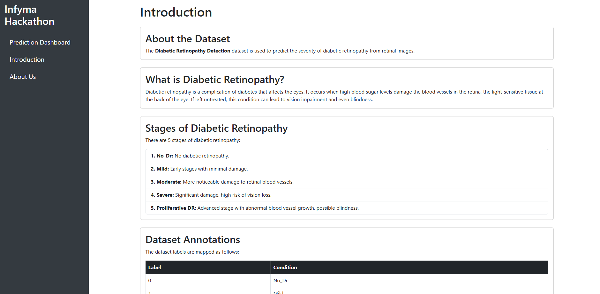
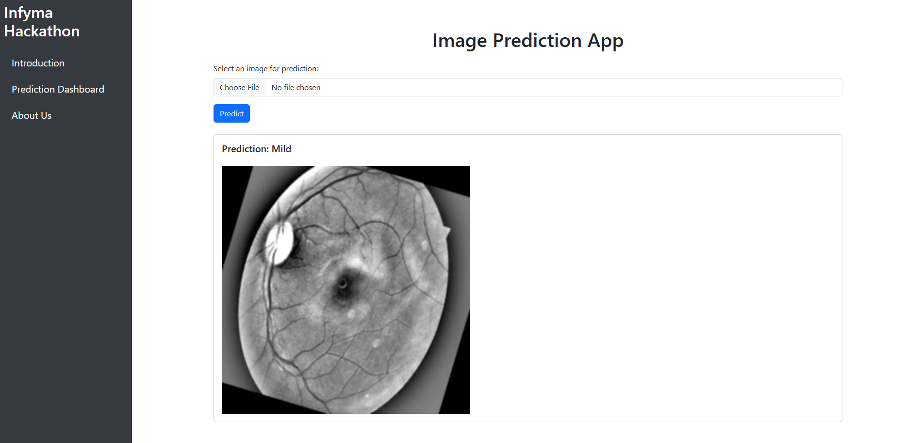

# 🧠 Infyma AI Hackathon - Diabetic Retinopathy Prediction

## 🎯 **Project Overview**
This project was developed as part of the **Infyma AI Hackathon**, with the goal of creating a **Flask web application** to predict **Diabetic Retinopathy (DR)** stages from retina images using a **deep learning model**. The app allows users to upload an image and receive a prediction about the **severity of Diabetic Retinopathy**.

---

## 📂 **Dataset Information**
**Diabetic Retinopathy** is a **diabetes-related eye condition** that can lead to **vision impairment** or **blindness**. The dataset used in this project contains images of retina scans, classified into **5 stages** of **Diabetic Retinopathy**:

| Label | Stage of Diabetic Retinopathy    |
|-------|---------------------------------|
| 0     | **No_DR**                        |
| 1     | **Mild**                         |
| 2     | **Moderate**                     |
| 3     | **Severe**                       |
| 4     | **Proliferative DR**             |

---

## 🧬 **Model Details**
- The model used is a **deep learning model** built with **TensorFlow** and **Keras**.
- The model file is **~400 MB** and is not directly uploaded to this repository.
- You can **download the model** from this **Google Drive link**: [Download model.h5](https://drive.google.com/drive/folders/1-cfuIYbwsHLOlt2kykQRK71G0T0eV4rI?usp=drive_link).

---

## 🚀 **Installation & Setup**
1. **Clone the repository:**
```bash
git clone https://github.com/Mohammad-Sofyan-Abdullah/Infyma-AI-Hackathon.git
cd Infyma-AI-Hackathon
```

2. **Create a virtual environment:**
```bash
python -m venv venv
source venv/bin/activate  # On Windows use: venv\Scripts\activate
```

3. **Install required packages:**
```bash
pip install -r requirements.txt
```

4. **Download the model** and place it in the **project directory**.

5. **Run the Flask app:**
```bash
python app.py
```

6. **Access the app** at:
```bash
http://localhost:5000
```

---

## 📑 **App Features**
- **Introduction Page:** Overview of the app and dataset.
- **Prediction Page:** Upload an image and get a prediction.
- **About Us Page:** Meet the team behind the project.

---

## 👨‍💻 **Team Neural Knights**
- **Mohammad Sofyan Abdullah**
- **Sumama bin Tahir**

---

## 💡 **Technologies Used**
- **Frontend:** HTML, CSS, Bootstrap
- **Backend:** Flask
- **Modeling:** TensorFlow, Keras
- **Deployment:** Localhost (can be extended to cloud)

---

## 📸 **Screenshots**
  
  

---

## 🛠️ **Future Improvements**
- Implement **cloud deployment** using **Heroku** or **AWS**.
- Add **model training notebook**.
- Improve **UI/UX design**.
- Integrate **additional model metrics** and visualization.

---

## 📬 **Contact**
For any queries, please contact **Mohammad Sofyan Abdullah** at **sofyanrajpoot567@gmail.com**
